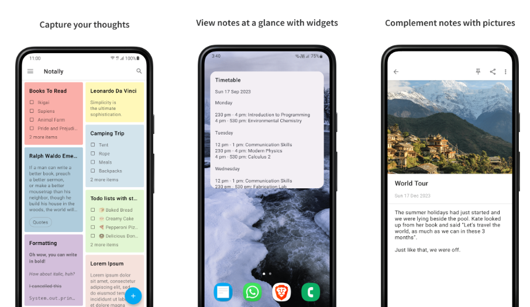

### 背景

1. 想制作一些既美观简洁的软件
2. 需要足够轻量
3. 日常生活需要使用

### 功能

1. 创建待办事项：(标题、备注、详细信息、分组)
2. 设置提醒时间：(通知)
3. 设置重复时间：(重复通知)
4. 本地通知：利用Ionic Native提供的插件实现本地通知功能
5. 标记完成： (已完成、待完成、未开始)
6. 事项分类： (分组)
7. 事项状态统计： (全部、计划、今日(9/10)、完成)
8. 云同步：(Redis、MySQL)（待完成）
9. 白天夜晚主题

